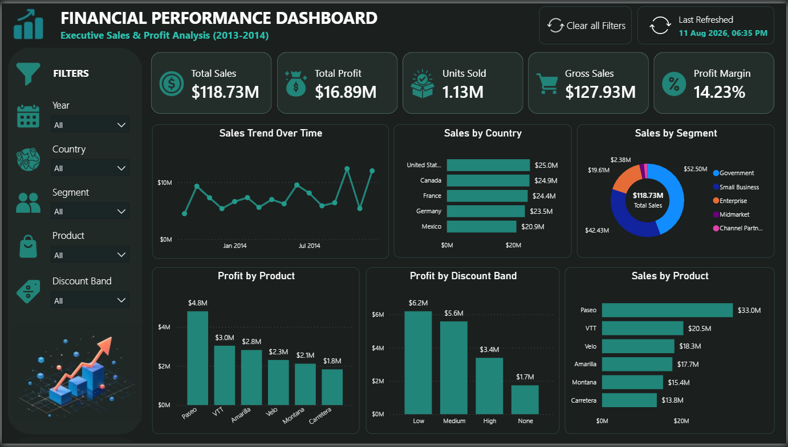

<div align="center">
  
# 📊 Financial Performance Dashboard


### *An end-to-end Data Analytics case study transforming raw financial data into decision-ready business insights.*

<p align="center"> 
   
   
   
   
   
   
</p>

</div>



## 🚀 Project Overview

This project was created as part of **Week 4: Data Visualization & Capstone Project**.

The goal was to follow a practical analytics workflow:

**Raw Data → Cleaning → Exploration → Analysis → Visualization → Insights → Recommendations**

The project uses a financial sales dataset containing products, countries, customer segments, discounts, sales, costs, profit, units sold, and dates.

The final deliverable is an **interactive Financial Performance Dashboard** designed from an executive/business perspective.

---

## 🎯 Project Objectives

This project answers practical business questions:

- How much sales and profit did the business generate?
- How is sales performance changing over time?
- Which countries contribute the most sales?
- Which customer segments generate the highest revenue?
- Which products perform best?
- How do discount bands relate to profitability?
- What is the overall profit margin?
- Which areas deserve management attention?

---

# 🧭 Analytics Workflow

```text
                 RAW FINANCIAL DATA
                         │
                         ▼
                🐍 PYTHON / PANDAS
              Data Cleaning & Validation
                         │
                         ▼
                📋 DATA EXPLORATION
                         │
                         ▼
             📊 BUSINESS ANALYSIS
                         │
                         ▼
                 📗 EXCEL ANALYSIS
                         │
                         ▼
                 ⚡ POWER BI
              Interactive Dashboard
                         │
                         ▼
              💡 BUSINESS INSIGHTS
                         │
                         ▼
              🎯 RECOMMENDATIONS
```

---

# 🛠️ Tools & Technologies

| Tool | Purpose |
|---|---|
| 🐍 **Python** | Data cleaning and exploration |
| 🐼 **Pandas** | Data manipulation and transformation |
| 📗 **Microsoft Excel** | Dataset review and supporting analysis |
| ⚡ **Power BI** | Interactive dashboard and visualization |
| 📐 **DAX** | Business metrics and calculated measures |
| 🔗 **GitHub** | Version control and project presentation |

---

# 📁 Project Structure

```text
Financial-Performance-Analysis/
│
├── 📄 README.md
├── 🐍 data_cleaning.py
├── 📊 Dataset.xlsx
├── ⚡ Dashboard.pbix
├── 🖼️ Dashboard.png
└── 📑 Report/
    └── Week_4_Explanation_Report.pdf

```

# 📌 Dataset

The project uses the **Financial Sample dataset provided for the Week 4 assignment**.

### Main fields

- Segment
- Country
- Product
- Discount Band
- Units Sold
- Manufacturing Price
- Sale Price
- Gross Sales
- Discounts
- Sales
- COGS
- Profit
- Date
- Month Number
- Month Name
- Year

The dataset contains **700 records** and supports analysis of sales performance, profitability, products, markets, segments, and discount strategies.

---

# 🧹 Data Cleaning with Python

The raw dataset was processed using **Python and Pandas**.

### Cleaning activities

- Loaded the Excel dataset.
- Inspected dataset structure and column names.
- Removed unwanted whitespace from column names.
- Checked missing values.
- Handled missing `Discount Band` values.
- Checked for duplicate records.
- Removed duplicate rows where applicable.
- Created a derived **Profit Margin** field.
- Exported cleaned Excel and CSV versions.

### Example

```python
df["Discount Band"] = df["Discount Band"].fillna("None")

df["Profit Margin"] = (
    df["Profit"] /
    df["Sales"].replace(0, pd.NA)
) * 100
```

---

# 📊 Key Business Metrics

The dashboard focuses on five executive-level KPIs:

### 💰 Total Sales
Overall sales generated by the business.

### 💵 Total Profit
Total profit generated after costs.

### 📦 Units Sold
Total product volume sold.

### 🛒 Gross Sales
Sales before discounts.

### 📈 Profit Margin

```text
Profit Margin = Total Profit / Total Sales × 100
```

This provides a concise view of how effectively sales are converted into profit.

---

# ⚡ Power BI Dashboard

## Financial Performance Dashboard

The dashboard uses an **executive dark-mode design** with a consistent visual hierarchy.

### Dashboard Components

**Executive KPIs**
- Total Sales
- Total Profit
- Units Sold
- Gross Sales
- Profit Margin

**Business Analysis**
- Sales Trend Over Time
- Sales by Country
- Sales by Segment
- Profit by Product
- Profit by Discount Band
- Sales by Product

**Interactive Filters**
- Year
- Country
- Segment
- Product
- Discount Band

### Design Principles

- Consistent dark theme
- Clear KPI hierarchy
- Minimal clutter
- Consistent chart styling
- Interactive filtering
- Business-focused chart selection
- Clear labels and metric formatting
- Executive-style information hierarchy

---

# 💡 Key Insights

Based on the completed dashboard:

### 1. 🏡 USA Country Performance
The **United States** is the highest-performing country by sales among the countries displayed.

### 2. 🏢 Segment Performance
The **Government** segment contributes the largest share of total sales.

### 3. 🏆 Product Performance
**Paseo** is the strongest product in the displayed product-level sales and profit comparisons.

### 4. 🎯 Discount Performance
The **Low discount band** generates the highest profit among the displayed discount categories.

### 5. 📈 Overall Profitability
The dashboard reports an overall **Profit Margin of 14.23%**.

> These observations should be interpreted together with the selected dashboard filters and reporting context.

---

# 🎯 Business Recommendations

### 01 — Strengthen High-Performing Markets
Investigate the factors driving strong performance in the leading country and evaluate whether similar strategies can be applied elsewhere.

### 02 — Focus on High-Value Segments
The Government segment represents a significant portion of sales, making it an important segment for retention and account-growth strategies.

### 03 — Prioritize Strong Products
High-performing products such as Paseo should receive attention in inventory planning, marketing, and sales strategies.

### 04 — Review Discount Strategy
The strong profit contribution from the Low discount band suggests that aggressive discounting should be evaluated carefully.

### 05 — Monitor Profitability, Not Revenue Alone
Management should track both **Sales** and **Profit Margin** to ensure revenue growth translates into sustainable profitability.

---

# 🔎 Dashboard Interaction

The dashboard includes interactive filters so users can move from an overall business view to focused analysis.

```text
Year
 ↓
Country
 ↓
Segment
 ↓
Product
 ↓
Discount Band
```

Stakeholders can investigate performance from multiple perspectives without needing separate dashboards for every scenario.

---

# 📐 Core DAX Measures

### Total Sales

```DAX
Total Sales =
SUM('Financials'[Sales])
```

### Total Profit

```DAX
Total Profit =
SUM('Financials'[Profit])
```

### Total Units

```DAX
Total Units =
SUM('Financials'[Units Sold])
```

### Gross Sales

```DAX
Gross Sales =
SUM('Financials'[Gross Sales])
```

### Profit Margin

```DAX
Profit Margin =
DIVIDE(
    SUM('Financials'[Profit]),
    SUM('Financials'[Sales]),
    0
)
```

Format **Profit Margin** as a percentage.

> Replace `Financials` with the actual Power BI table name if your model uses a different name.

---

# 📷 Dashboard Preview

After adding the final screenshot to the repository:


---

# 🧠 What This Project Demonstrates

- Data cleaning
- Data validation
- Missing-value handling
- Exploratory analysis
- Business metric design
- KPI development
- Data visualization
- Dashboard design
- Interactive filtering
- Business storytelling
- Insight generation
- Recommendation development

---

# 🧠 From Data to Decisions

The real outcome of this project is the transition:

```text
DATA
 ↓
INFORMATION
 ↓
INSIGHT
 ↓
DECISION
 ↓
BUSINESS ACTION
```

A dashboard becomes valuable when it helps a stakeholder understand **what happened, why it matters, and what should happen next**.

---

# 📑 Assignment Alignment

| Week 4 Requirement | Implementation |
|---|---|
| Power BI / Tableau dashboard | ✅ Power BI Dashboard |
| Business metrics | ✅ Executive KPIs |
| Filters | ✅ Interactive slicers |
| Storytelling with data | ✅ Business-focused visual structure |
| Stakeholder insights | ✅ Key Insights section |
| Python data cleaning | ✅ Pandas cleaning script |
| Data analysis | ✅ Analytical measures and dashboard analysis |
| Excel visualization/support | ✅ Excel dataset and analysis |
| Complete code | ✅ Python source included |

---

# 📦 Deliverables

### Source Code
`Python/data_cleaning.py`

### Dataset
Original and cleaned dataset files.

### Power BI
`PowerBI/Financial_Performance_Dashboard.pbix`

### Dashboard Preview
`Dashboard.png`

### Explanation Report
`Report/Week_4_Explanation_Report.pdf`

---

# 👨‍💻 Project Author

**Data Analyst Portfolio Project**

> *Turning raw business data into clear, actionable insights.*

---

## ⭐ Final Thought

> **Good analysis answers a question. Great analysis helps someone make a decision.**

<br> 
<p align="center">
  <b>📊 Financial Performance Analysis</b><br>
  Python • Pandas • Excel • Power BI • DAX
</p>
